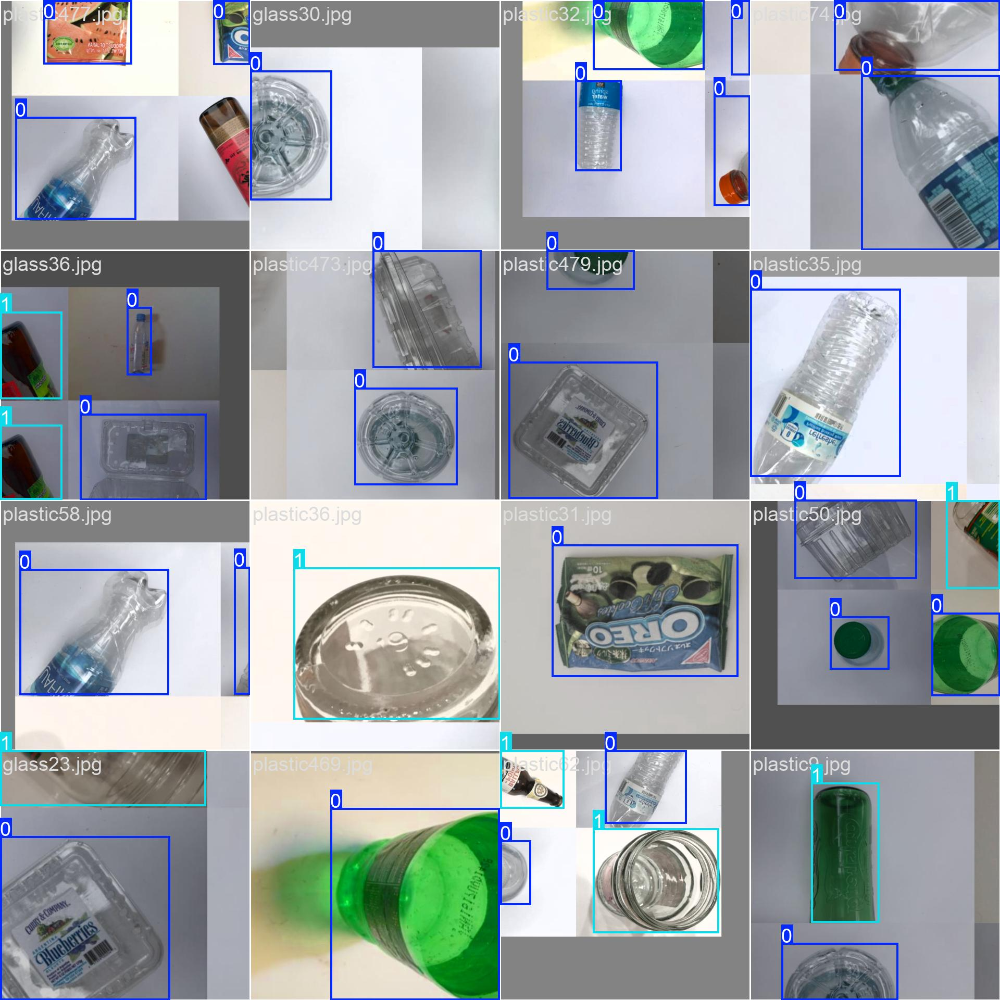
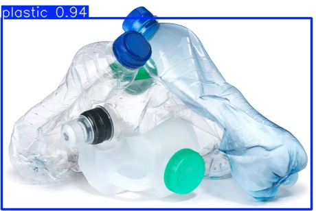

# 🔍 YOLO Object Detection Demo

## 📸 ตัวอย่างผลการเทรน




---

## 🚀 ขั้นตอนการใช้งาน

### 1. สร้าง Virtual Environment และติดตั้ง Ultralytics

```bash
# ติดตั้ง virtualenv หากยังไม่มี
pip install virtualenv

# สร้าง virtual environment ชื่อ myYoLo
virtualenv myYoLo

# เข้าใช้งาน virtual environment (สำหรับ Windows)
.\myYoLo\Scripts\activate

# ติดตั้ง ultralytics ซึ่งรวม YOLOv8
pip install ultralytics

ทดลองการใช้งาน โดยการสร้างไฟล์ *.py โดยมีโค้ดตามด้านล่าง
---------------------------------------------------- code --------------------------------------------------------
from ultralytics import YOLO
import matplotlib.pyplot as plt
import cv2
import numpy as np
from PIL import Image

# Load a model
model = YOLO("yolov8n.pt")  # load an official model

results = model(["https://ultralytics.com/images/bus.jpg"], conf=0.3)  # return a list of Results objects

# Process results list
for result in results:
    boxes = result.boxes  # Boxes object for bounding box outputs
    result.show()  # display to screen
    result.save(filename="result.jpg")  # save to disk

---------------------------------------------------- code --------------------------------------------------------

download Data and training แต่ถ้าจะใช้ Label เพิ่ม?
https://docs.ultralytics.com/datasets/detect/coco8/

LabelImg
https://github.com/HumanSignal/labelImg
https://roboflow.com/

use my model for prediction
https://docs.ultralytics.com/modes/predict/

ultralytics input dataset format
https://docs.ultralytics.com/datasets/detect/#ultralytics-yolo-format


